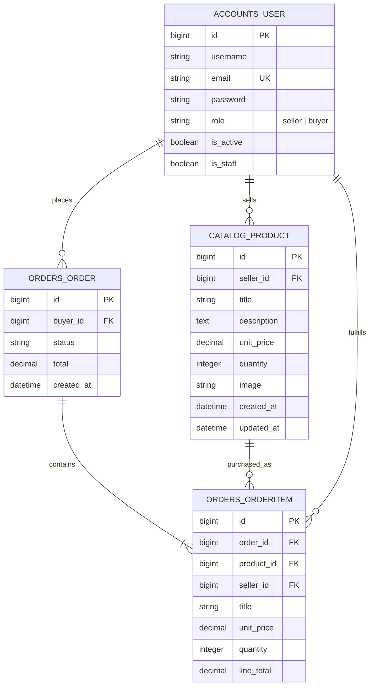

# StoreMesh Entity Relationship Diagram

```mermaid
erDiagram
  ACCOUNTS_USER {
    bigint id PK
    string username
    string email UK
    string password
    string role "seller | buyer"
    boolean is_active
    boolean is_staff
  }

  CATALOG_PRODUCT {
    bigint id PK
    bigint seller_id FK
    string title
    text description
    decimal unit_price
    integer quantity
    string image
    datetime created_at
    datetime updated_at
  }

  ORDERS_ORDER {
    bigint id PK
    bigint buyer_id FK
    string status
    decimal total
    datetime created_at
  }

  ORDERS_ORDERITEM {
    bigint id PK
    bigint order_id FK
    bigint product_id FK
    bigint seller_id FK
    string title
    decimal unit_price
    integer quantity
    decimal line_total
  }

  ACCOUNTS_USER ||--o{ CATALOG_PRODUCT : sells
  ACCOUNTS_USER ||--o{ ORDERS_ORDER : places
  ORDERS_ORDER ||--|{ ORDERS_ORDERITEM : contains
  CATALOG_PRODUCT ||--o{ ORDERS_ORDERITEM : purchased_as
  ACCOUNTS_USER ||--o{ ORDERS_ORDERITEM : fulfills
```

`OrderItem` snapshots product title and unit price so past orders remain accurate even when a seller edits a listing later.
